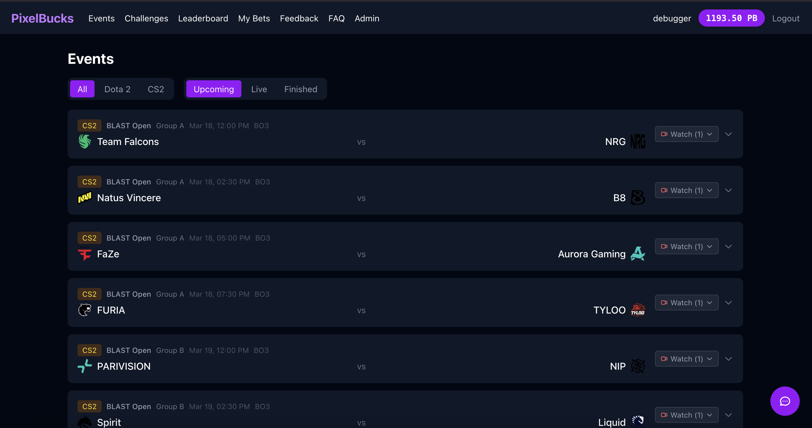

# [PixelBucks](https://pixelbucks.org)

Virtual-money esports betting platform for Dota 2 and CS2. No real money — just PixelBucks (PB) for fun.



## Features

- **Esports Betting** — Browse upcoming Dota 2 & CS2 matches synced from PandaScore, place bets with virtual currency
- **Live Match Tracking** — Automatic status updates (upcoming → live → finished), embedded Twitch streams on event pages
- **Wallet System** — Start with 1,000 PB, weekly replenishment of 500 PB, profit/loss tracking
- **Real-time Chat** — Socket.IO chat with English and Russian rooms, emoji support, URL image embeds
- **Challenges** — Daily and weekly challenges with PB rewards
- **Leaderboard** — Top bettors ranked by balance
- **Admin Panel** — Manage odds, users, balances, and view platform stats
- **Feedback System** — Users can submit feedback (3 per week, 500 char limit)

## Tech Stack

| Layer | Tech |
|-------|------|
| Backend | NestJS 11, TypeScript, Prisma 7, PostgreSQL |
| Frontend | React 19, TypeScript, Vite 8, Tailwind CSS 4 |
| Messaging | RabbitMQ (event-driven bet resolution via outbox pattern) |
| Jobs | BullMQ + Redis (PandaScore sync, challenges, replenishment) |
| Chat | Socket.IO |
| Data | PandaScore API (free tier) |

## Quick Start

### Prerequisites

- Node.js 20+
- Docker & Docker Compose

### 1. Start infrastructure

```bash
docker compose up -d
```

This starts PostgreSQL (port 5444), RabbitMQ (port 5777), and Redis (port 6777).

### 2. Backend

```bash
cd backend
cp .env.example .env   # edit with your PandaScore token
npm install
npx prisma db push
npm run start:dev
```

The API runs on `http://localhost:3000`.

### 3. Frontend

```bash
cd frontend
npm install
npm run dev
```

The app runs on `http://localhost:5173` with API proxy to the backend.

### 4. Open the app

Visit `http://localhost:5173`, register an account, and start betting!

## Environment Variables

| Variable | Description | Default |
|----------|-------------|---------|
| `DATABASE_URL` | PostgreSQL connection string | — |
| `RABBITMQ_URL` | RabbitMQ connection string | — |
| `REDIS_URL` | Redis connection string | — |
| `JWT_SECRET` | Secret for JWT signing | — |
| `JWT_EXPIRES_IN` | JWT expiry in ms | `604800000` (7 days) |
| `PANDASCORE_TOKEN` | PandaScore API key | — |
| `PANDASCORE_BASE_URL` | PandaScore API base URL | `https://api.pandascore.co` |
| `PANDASCORE_TIERS` | Tournament tiers to sync | `s,a` |
| `FRONTEND_URL` | Frontend URL for CORS | `http://localhost:5173` |
| `THROTTLE_TTL` | Rate limit window (ms) | `60000` |
| `THROTTLE_LIMIT` | Max requests per window | `60` |
| `GLOBAL_MAX_BET` | Max bet in cents | `10000` |
| `PORT` | Backend port | `3000` |

## Production Deployment

### Docker Compose

```bash
# Create .env with secrets
cat > .env << 'EOF'
DB_USER=pixelbucks
DB_PASSWORD=<strong-password>
RMQ_USER=pixelbucks
RMQ_PASSWORD=<strong-password>
JWT_SECRET=<64-char-random-string>
PANDASCORE_TOKEN=<your-token>
FRONTEND_URL=http://your-domain
EOF

# Build and run
docker compose -f docker-compose.prod.yml up -d --build
```

See [DEPLOY.md](DEPLOY.md) for detailed deployment options (managed services or single VPS).

## Project Structure

```
backend/
  src/
    auth/          — Register, login, JWT guards
    users/         — Profile, stats, replenishment
    events/        — PandaScore sync, match listing
    bets/          — Bet placement & resolution
    chat/          — WebSocket gateway
    challenges/    — Daily/weekly challenges
    admin/         — User & event management
    feedback/      — User feedback
    prisma/        — Database service
    rabbitmq/      — Message broker
    outbox/        — Outbox pattern processor
    validations/   — fastest-validator infrastructure
  prisma/
    schema.prisma  — Database schema (10 models)
  test/
    app.e2e-spec.ts    — integration tests
    chat.e2e-spec.ts   — chat e2e tests

frontend/
  src/
    pages/         — All page components
    components/    — Layout, chat widget, error boundary, toasts
    api/           — Axios API clients
    context/       — Auth context
    types/         — TypeScript types
```

## Tests

```bash
cd backend
npm run test:e2e
```

Runs integration tests covering auth, users, events, bets, bet resolution, profit tracking, and chat.
